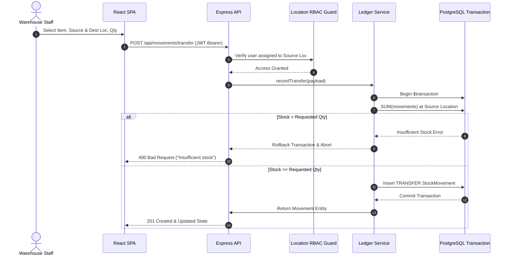

# System Architecture & Technical Design

## Inventory & Stock Control System (BUSY Take-Home Evaluation)

### 1. High-Level Architecture

The system is designed as a decoupled, multi-tier enterprise web application adhering to clean architecture, transactional consistency, and strict append-only stock ledger integrity.

```
┌────────────────────────────────────────────────────────┐
│               Client Tier (React 18 SPA)               │
│  - Vite + TypeScript + Tailwind CSS                    │
│  - Recharts Visual Analytics                           │
│  - Role-Aware Dynamic UI (Manager vs Staff)            │
└─────────────────────────┬──────────────────────────────┘
                          │ HTTPS / JWT Bearer REST API
                          ▼
┌────────────────────────────────────────────────────────┐
│            Application Tier (Node.js / Express)        │
│  ┌──────────────────────────────────────────────────┐  │
│  │ Middlewares: Auth (JWT), RBAC Guards, ErrorHandler│  │
│  └──────────────────────────────────────────────────┘  │
│  ┌──────────────────────────────────────────────────┐  │
│  │ Core Services:                                   │  │
│  │  • LedgerService (On-the-fly summation & txs)   │  │
│  │  • AlertService (Dynamic threshold evaluator)    │  │
│  │  • CsvService (Partial success stream pipeline)  │  │
│  └──────────────────────────────────────────────────┘  │
└─────────────────────────┬──────────────────────────────┘
                          │ Prisma ORM (Typed Queries & Transactions)
                          ▼
┌────────────────────────────────────────────────────────┐
│             Database Tier (PostgreSQL)                 │
│  - Append-Only Stock Movements (Ledger)                │
│  - Multi-Location & Staff Permission Matrix            │
│  - Dynamic Item Timeline & Low-Stock Alerts            │
└────────────────────────────────────────────────────────┘
```

---

### 2. Core Design Principles

#### A. Pure Append-Only Stock Ledger
- **No Mutable Quantity Column**: The `Item` and `Location` tables contain **zero** mutable quantity fields.
- **Deterministic Math**: Current stock is computed in real time from immutable transaction rows:
  $$\text{Stock}_{\text{loc}} = \sum \text{Receipts}_{\text{loc}} - \sum \text{Issues}_{\text{loc}} + \sum \text{TransfersIn}_{\text{loc}} - \sum \text{TransfersOut}_{\text{loc}} + \sum \text{Adjustments}_{\text{loc}}$$
- **Auditability**: Eliminates race conditions, ghost edits, and untracked inventory modifications. Every stock change is permanently attributed to an authenticated user with timestamp, reference code, and notes.

#### B. Single Transaction Inter-Location Transfers
- Inter-location transfers ($Location_A \to Location_B$) execute inside an atomic database transaction (`prisma.$transaction`).
- A pre-flight ledger check evaluates available stock at $Location_A$. If insufficient, the entire operation is rolled back with an explicit descriptive error.

#### C. Role-Based Access Control (RBAC) & Location Scoping
- **Manager**: Global administrative privileges (create/update/archive items, create locations, assign staff to locations, stock adjustments, full ledger view).
- **Warehouse Staff**: Restricted operational access (can strictly perform receipts, issues, and transfers only at locations explicitly assigned to their user ID).
- Authorization is enforced at the backend middleware level (`requireManager`, `requireLocationAccess`), ensuring client-side tampering cannot bypass security boundaries.

#### D. Partial-Success CSV Engine
- Unlike fragile all-or-nothing batch scripts, the CSV engine processes files row-by-row.
- Valid rows are committed immediately.
- Invalid rows (e.g. non-existent category, duplicate SKU, invalid quantity) are isolated and returned with exact row numbers and human-readable diagnostic messages.

---

### 3. Data Flow Diagrams

#### Stock Transfer Data Flow

