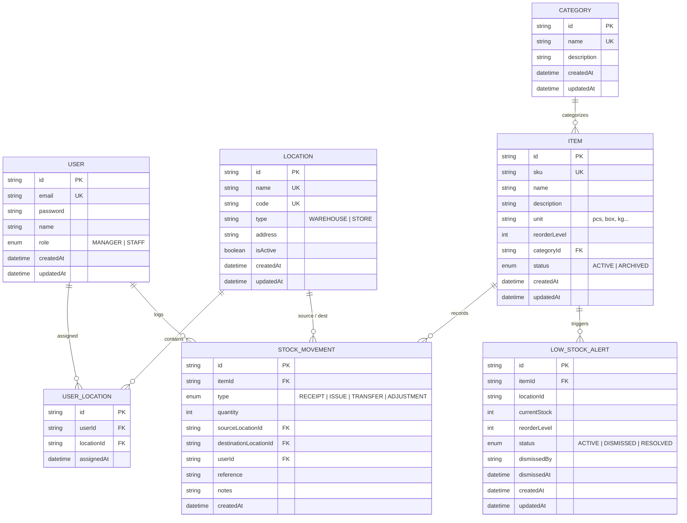

# Database Schema & Entity Relationships

## PostgreSQL & Prisma Data Architecture

### Entity Relationship Model

---

### Key Tables & Indexes

#### 1. `StockMovement` (Append-Only Ledger)
- **Primary Key**: `id` (UUID)
- **Indexes**:
  - `itemId` — Fast lookups for item ledger summation and timeline retrieval.
  - `type` — Fast filtering by receipt, issue, transfer, or adjustment.
  - `sourceLocationId` & `destinationLocationId` — Fast location-wise stock aggregation queries.
  - `createdAt` — Time-series queries and 8-week movement trend aggregations.

#### 2. `Item`
- **Unique Constraint**: `sku`
- **Soft Delete**: `status` field (`ACTIVE` vs `ARCHIVED`). Items are never hard-deleted once movements exist.

#### 3. `UserLocation`
- **Compound Unique Constraint**: `(userId, locationId)` ensures idempotency in staff location assignments.
